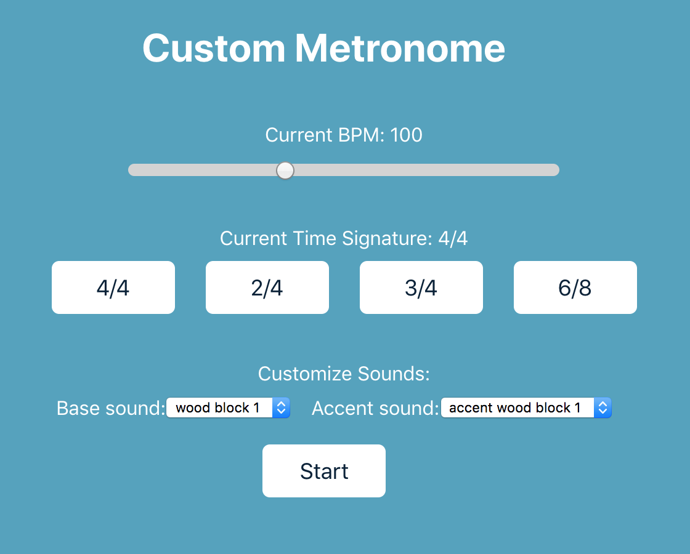

# Custom React Metronome

This project was bootstrapped with [Create React App](https://github.com/facebook/create-react-app).

This will help me practice piano!

## How to use

In the project directory, run `npm start` to start the app.

Then:

1) Open [http://localhost:3000](http://localhost:3000) to view it in the browser.

2) Turn your sound on!

3) Press the Start button.

4) Use the slider, buttons, and dropdowns to customize the metronome to your liking.

...

...

...

Tests pending...
